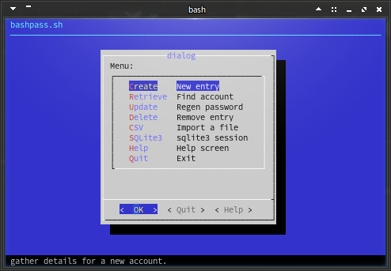
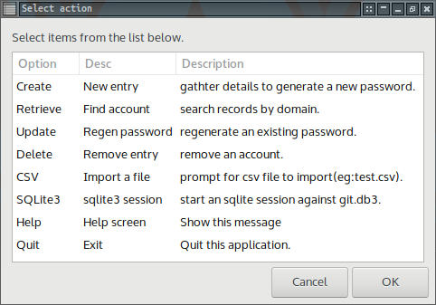

# 
bashpass

  password generator, storage, reference for the terminal.

## 
Use case

  1. I can create passwords
  2.   \>>  recall passwords
  3.   \>>  update passwords
  4.   \>>  delete accounts
  5.   \>>  import a csv file.

### 
[bashpass.sh](bashpass.sh)

Terminal only

### 
[dialogpass.sh](dialogpass.sh)

With dialog.

### 
[zenitypass.sh](zenitypass.sh)

Using [zenity](https://help.gnome.org/users/zenity)

## 
TODOS

  1. Encryption
  1. Modularize UI usage depending on the environment.

      GUI/TUI based on X

      GUI's based on availability
