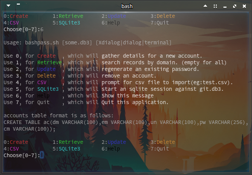

# 
bashpass

  password generator, storage, reference for the terminal.

## 
Use case

  1. I can create passwords
  2.   \>>  recall passwords
  3.   \>>  update passwords
  4.   \>>  delete accounts
  5.   \>>  import a csv file.
