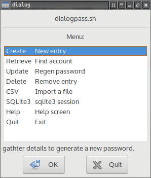

# bashpass

password generator, storage, reference for the terminal and/or X.

## Use case

  * I can create passwords
  *    //  recall passwords
  *    //  update passwords
  *    //  delete accounts
  *    //  import a csv file.

### <p align="center">[bash](bashpass.sh)</p>
<p align="center">Terminal only</p>
<p align="center"><a href="assets/bp.png"></a></p>

### <p align="center">[dialog](bashpass.sh)</p>
<p align="center">Without X using dialog (unset DISPLAY to test).</p>
<p align="center"><a href="assets/dp.png"></a></p>

### <p align="center">[Xdialog](bashpass.sh)</p>
<p align="center">On X using Xdialog.</p>
<p align="center"><a href="assets/xp.png"></a></p>

## Usage

### First time use:

 1. Easy: Run [first-use.sh](first-use.sh) from [this](./) directory.
 2. Manual: You'll need to build git.db3 like so: ```sqlite3 git.db3 < ac.sql``` and encrypt it like so: ```gpg2 --default-recipient-self --output git.db3.asc --encrypt git.db3```

Reason being sqlite3 *.db3 files you'll work with need to be encrypted to your own keyring(/s).

All relevant files must reside in [this](./) directory.

### Subsequent uses:

For subsequent uses just fire up the script directly: ```bashpass.sh git.db3```

### NOTES

You can only have one instance of [bashpass.sh](bashpass.sh) running at any given time.

Consider launching [bashpass.sh](bashpass.sh) with launch from terminal option enabled (where available) and through [bashpass-launcher.sh](bashpass-launcher.sh) if not (DE hotkey for example).

### Security concern

A potentially misplaced hard drive if examined by a file recovery tool could reveal unencrypted version of password database files (.db3).

### Workaround

by shredding along with removing unencrypted .db3 files upon trapped exit signals.

## TODOS

 * [x] Encryption
 * [ ] ~~Clipboard~~ (more prerequisites - dependencies, eg: xclip) just consult your manual for copy-paste functionality.
 * [x] Modularize UI usage depending on the environment.

   * [x] GUI's based on availability
   * [x] GUI/TUI based on X
